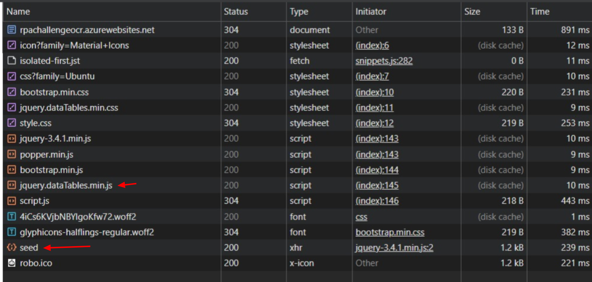

## À equipe de avaliação

Minhas saudações à equipe da DOC9, prazer estar fazendo parte do processo seletivo!

Separei essa seção para discorrer brevemente sobre as decisões mais diferentes que tomei no código que possam vir a gerar questionamentos, mas ainda me coloco à disposição caso queiram me contatar.

1º consideração - Sobre a forma de extração de dados da tabela, no e-mail foi apontado o uso do Selenium porém acabei optando pelo uso de um request básico, visto que com o Selenium eu não consegui fazer um tempo de execução melhor do que 5 segundos, então explorei a aba de desenvolvedor "Network" (conforme imagem abaixo) do navegador e achei um método POST que me permitiu pingar direto nele a requisição. Isso diminuiu meu tempo de execução para 2.11, foi o melhor tempo que consegui para este desafio.

2º consideração - O uso da biblioteca de dataclass para armazenar as informações coletadas do site é basicamente para permitir uma estruturação mais nítida do conjunto de dados que estou extraindo e a facilidade de manipulá-los/transportá-los posteriormente para uma base de dados ou um arquivo csv como é o caso do desafio.

3º consideração - O uso de um arquivo commom_vars.py para armazenar variáveis é apenas uma alternativa rápida para uma centralização de variáveis/"credenciais", mas entendo que no dia a dia é boa prática usar um vault.

4º consideração - Utilizei logs apenas para demonstrar a importância que dou a um registro bem estruturado das execuções da automação. Mas também entendo que num ambiente produtivo é mais comum utilizar uma ferramenta com API para tal, como DataDog e afins.

5º consideração - Apesar da simplicidade do projeto, e a possibilidade de escrever tudo em um arquivo único, a estruturação do meu projeto foi uma tentativa de elucidar a importância que eu dou a um código bem planejado que permita escalabilidade independente da complexidade, sempre visando a otimização do mesmo, sem ser prolixo.

Atenciosamente, Vitor Silva.
<!-- Espaço reservado para comentários da equipe de avaliação -->

# Invoice Scrapper Doc9 — Automation Challenge

Este repositório contém a solução para o desafio de automação do processo seletivo da Doc9. O objetivo do projeto é automatizar a extração de informações de faturas (invoices) a partir de uma aplicação web, realizando o download dos arquivos PDF e salvando os dados relevantes em arquivos CSV, com registro detalhado de logs de execução.

## Propósito Geral

Automatizar o processo de coleta de dados de faturas em uma plataforma web, incluindo:
- Extração de dados tabulares (número da fatura, data, link para download).
- Download automático dos arquivos PDF das faturas.
- Filtragem de dados conforme a data de vencimento.
- Geração de relatórios em CSV.

## Principais Pontos do Projeto

- **Logger customizado:** Geração de logs em arquivos separados por execução, com formatação detalhada e logs em console.
- **Web Scraping ágil:** Uso de requests para raspar dados de tabelas e download assíncrono de arquivos do processo
- **Download automatizado:** PDFs dos invoices são baixados automaticamente para a pasta `output/`.
- **Estrutura modular:** Separação clara entre funções de scraping, utilitários, configuração e tipos de dados.
- **Persistência de dados:** Dados extraídos e processados são salvos em arquivos CSV para fácil consulta posterior.
- **Requisitos:** Dependências gerenciadas via `requirements.txt`.

## Como Executar
# 1) instalar dependências
pip install -r requirements.txt
# 2) executar
python main.py

## Estrutura do Projeto

- `main.py` — Orquestra o fluxo principal da automação.
- `general_functions/` — Configuração, logger e tipos de dados.
- `images/` - Imagens do projeto.
- `process/` — Funções de scraping e manipulação de dados.
- `output/` — Resultados gerados pela automação.
- `logs/` — Arquivos de log de execução.

---
